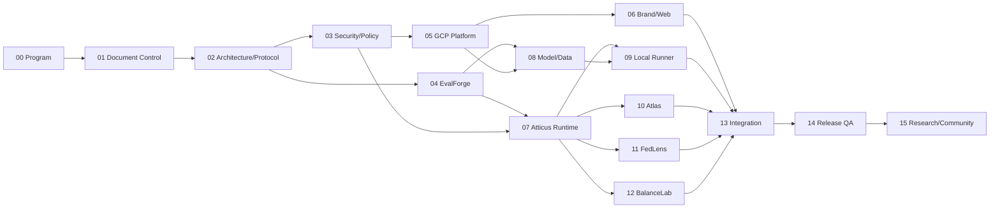

# Sequential Agent Execution Plan

## Purpose

DRL agents run sequentially, but sequential execution does not eliminate integration risk. This plan defines the authoritative order, entry gates, expected branches, handoff controls, and permitted return loops.

## Critical path

Where the diagram shows parallel-ready dependencies, the human operator may still run agents sequentially in any topologically valid order. The default recommended order is numeric.

## Gate before every mission

1. Previous PR merged or explicitly marked integration-ready.
2. `WORKLOG.md` contains a complete handoff.
3. Foundation validation passes on the inherited commit.
4. No unresolved blocker affects the mission’s owned contracts.
5. Required ADRs are approved.
6. Agent reserves the mission and branch in the worklog.

## Return loops

A later agent may discover an upstream defect. It must create a focused issue and either:

- fix it in a narrowly scoped coordinated PR if ownership permits and contracts do not change; or
- return it to the owning mission with a failing test and reproduction; or
- propose an ADR if the correction changes architecture or public behavior.

No compatibility shim may become permanent without documentation, tests, ownership, and a removal or support policy.

## Integration branch policy

- `main` contains only director-approved stable foundations/releases.
- `integration/v1` receives approved mission PRs and is the baseline for sequential work.
- Feature branches are cut from the latest `integration/v1`.
- Release candidates use `release/v1.0.0-rcN` and accept only reviewed defect/documentation fixes.

## Agent tool neutrality

Codex, Claude Code, Cursor, Copilot, and Gemini may all execute missions. The repository instructions, not a tool’s hidden defaults, govern behavior. Any tool-specific generated metadata must remain optional and must not become the only source of project state.

## Human checkpoints

DeWitt must review at minimum:

- base-model selection;
- public identity/brand constitution;
- security permission expansion;
- cloud cost hard-cap or topology changes;
- mixed-license decisions and model/data releases;
- V1 scope changes;
- release-gate waivers;
- production promotion and public launch.

## Open-source identity thread

Open-source identity is a cross-mission dependency rather than a final communications task. Mission 02 owns contracts; Mission 05 owns open infrastructure decision evidence; Mission 06 owns public identity surfaces; Mission 08 owns the Atticus Open Model Commons; Mission 13 owns the signature demonstration; Mission 14 independently verifies every claim; Mission 15 owns community, credit, replication, and accountability. Each handoff links the applicable DRL-OSS requirements and release evidence.
